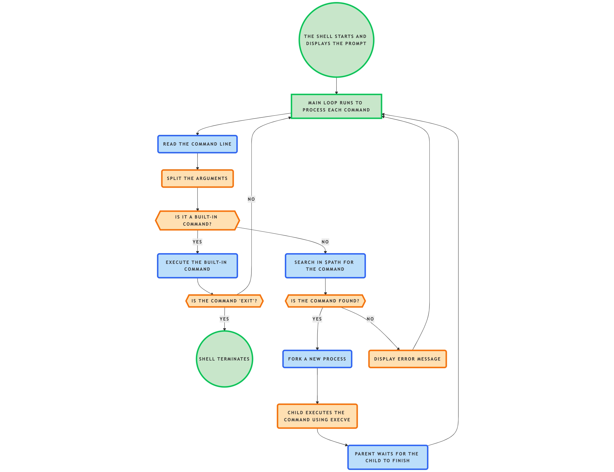

Simple Shell 

A minimalist command-line interpreter written in C that mimics basic UNIX shell behavior.  
Developed as part of the **Holberton School** curriculum.

---

## 📑 Table of Contents

1. [Introduction]  
2. [Installatio]
3. [Prerequisites]
4. [Allowed functions and System Calls]
5. [Files] 
6. [Usage Examples]  
7. [Man Page]
8. [Valgrind]
9. [Flochart] 
10.[Testing]  
11.[License] 
12.[Authors]

---

## 1. 📘 Description

This shell displays a prompt (`(¬‿¬) `), reads user input, searches the command in the `PATH`, and executes the command if found. It works in both interactive (line-by-line) and non-interactive (e.g., script) modes.

### Features:

- Displays a prompt (`(¬‿¬) `)
- Reads input using `getline`
- Tokenizes the command line
- Searches for commands in the `PATH`
- Executes commands using `execve`
- Handles Ctrl+D to exit
- Prints an error if the command is not found

---

## 2. ⚙️ Installation

*   How to clone:

Step 1: Clone a repository, Git creates a local copy of it git clone 

Step 2: Set the push.autoSetupRemote option

After clonning the repository, I can set this option to simplif future git push commands whan creating new branches 

git config --global push.autoSetupRemote true

Step 3: Create a branch and push it

Create a new branch and push it for the first time, Git will automatically link that branch to the corresponding remote branch without requiring youto use --set-upstream.

git checkout -b my-new-branch (Olivia) git push

* How to compile:

gcc -Wall -Werror -Wextra -pedantic -std=gnu89 *.c -o hsh

---

## 3.   Requierement

Ubuntu 20.x (the environment used for development)

GCC (GNU Compiler Collection) for compiling the C code

Git for version control and collaboration

---

## 4.   Allowed Functions and System Calls

The project may only use the following functions and system calls:

List of allowed functions and system calls+
- all functions from string.h
- access (man 2 access)
- chdir (man 2 chdir)
- close (man 2 close)
- closedir (man 3 closedir)
- execve (man 2 execve)
- exit (man 3 exit)
- _exit (man 2 _exit)
- fflush (man 3 fflush)
- fork (man 2 fork)
- free (man 3 free)
- getcwd (man 3 getcwd)
- getline (man 3 getline)
- getpid (man 2 getpid)
- isatty (man 3 isatty)
- kill (man 2 kill)
- malloc (man 3 malloc)
- open (man 2 open)
- opendir (man 3 opendir)
- perror (man 3 perror)
- printf (man 3 printf)
- fprintf (man 3 fprintf)
- vfprintf (man 3 vfprintf)
- sprintf (man 3 sprintf)
- putchar (man 3 putchar)
- read (man 2 read)
- readdir (man 3 readdir)
- signal (man 2 signal)
- stat (__xstat) (man 2 stat)
- lstat (__lxstat) (man 2 lstat)
- fstat (__fxstat) (man 2 fstat)
- strtok (man 3 strtok)
- wait (man 2 wait)
- waitpid (man 2 waitpid)
- wait3 (man 2 wait3)
- wait4 (man 2 wait4)
- write (man 2 write)

---

## 4.   Usage Exemples

*   Exécution du shell:

./hsh

*   Commandes supportée:

(¬‿¬) ls
(¬‿¬) /bin/ls
(¬‿¬) echo Hello
(¬‿¬) cat shell.h

    For quit : use Ctrl+D (EOF) or exit.

---

## 5. Flies

| Files              | Description                                                             |
|--------------------|-------------------------------------------------------------------------|
| `README.md`        | Information about this repository                                       |
| `hsh`              | Executable file for the shell application                               |
| `executor.c`       | Handles command execution and process management                        |
| `main.c`           | Main function of this application                                       |
| `parser.c`         | For parsing and processing the user's input                             |
| `shell.h`          | List of used libraries and function prototypes                          |
| `path_utils.c`     | Utility functions for managing the PATH and directories                 |
| `string_utils1.c`  | String manipulation functions (first set of utilities)                  |
| `string_utils2.c`  | String manipulation functions (second set of utilities)                 |

---

## 6. Man Page

This project includes a custom man page for the hsh shell.

*   To view it, run:

bash
Copier le code
man ./hsh.1
The man page documents:

*   How to launch the shell:

Supported features and usage
Example commands
Return values
Author information

It follows standard UNIX manual formatting and is located in the root of the repository as hsh.1.

---

## 7. Valgrinf

*    How to use Valgrind

1. First, compile your program an usual:

gcc -Wall -Werror -Wextra -pedantic -std=gnu89 *.c -o hsh

2. Run your shell program with Valgrind:

valgrind --leak-check=full --show-leak-kinds=all --track-origins=yes ./hsh

3. Example Output:

user@host:~/simple_shell$ valgrind --leak-check=full --show-leak-kinds=all --track-origins=yes ./hsh

==7165== Memcheck, a memory error detector
==7165== Copyright (C) 2002-2022, and GNU GPL'd, by Julian Seward et al.
==7165== Using Valgrind-3.22.0 and LibVEX; rerun with -h for copyright info
==7165== Command: ./hsh
==7165==
(¬‿¬)==7165==
==7165== HEAP SUMMARY:
==7165==     in use at exit: 0 bytes in 0 blocks
==7165==   total heap usage: 2 allocs, 2 frees, 1,144 bytes allocated
==7165==
==7165== All heap blocks were freed -- no leaks are possible
==7165==
==7165== For lists of detected and suppressed errors, rerun with: -s
==7165== ERROR SUMMARY: 0 errors from 0 contexts (suppressed: 0 from 0)

---

## 8. Flowchart

## 9. Testing

- Listing files in the current directory

(¬‿¬) ./hsh
(¬‿¬) ls
README.md   hsh     parser.c      shell.h         string_utils1.c
executor.c  main.c  path_utils.c  string_utils.c  string_utils2.c

- Echoing user input

(¬‿¬) echo Hello, Shell!
Hello, Shell!

- Direct path execution of ls

(¬‿¬) /bin/ls
README.md   hsh     parser.c      shell.h         string_utils1.c
executor.c  main.c  path_utils.c  string_utils.c  string_utils2.c

-   Handling unknown command

(¬‿¬) fauxcmd
./hsh: fauxcmd: not found

-   Using ls -l to list directory contents

(¬‿¬) ls -l /tmp

total 24
drwx------ 2 root root 4096 Apr 25 10:51 snap-private-tmp
drwx------ 3 root root 4096 Apr 25 11:26 systemd-private-e69f99f85613413598659327f77a2d4e-polkit.service-NSftRK
drwx------ 3 root root 4096 Apr 25 10:53 systemd-private-e69f99f85613413598659327f77a2d4e-systemd-logind.service-uLW4k5
drwx------ 3 root root 4096 Apr 25 10:51 systemd-private-e69f99f85613413598659327f77a2d4e-systemd-resolved.service-2UuoW0
drwx------ 3 root root 4096 Apr 25 10:51 systemd-private-e69f99f85613413598659327f77a2d4e-systemd-timesyncd.service-oWj584
drwx------ 3 root root 4096 Apr 25 10:53 systemd-private-e69f99f85613413598659327f77a2d4e-wsl-pro.service-LnjSRH

-   User interrupt using Ctrl+C

(¬‿¬) ^C

-   Shell exit using Ctrl+D

(¬‿¬) (Press Ctrl+D)

-   Exiting the shell using the exit command

(¬‿¬) ./hsh
(¬‿¬) exit

---

## 10. License

This project is licensed under the MIT License - see the LICENSE file for details.
Feel free to copy and paste this into your README.md file and make any adjustments you need.

---

## 11. Authors

- Maxime : https://github.com/Roupies
- Olivia Letchy : https://github.com/Ravou
